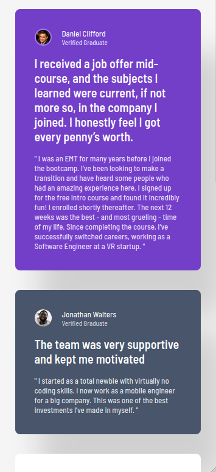
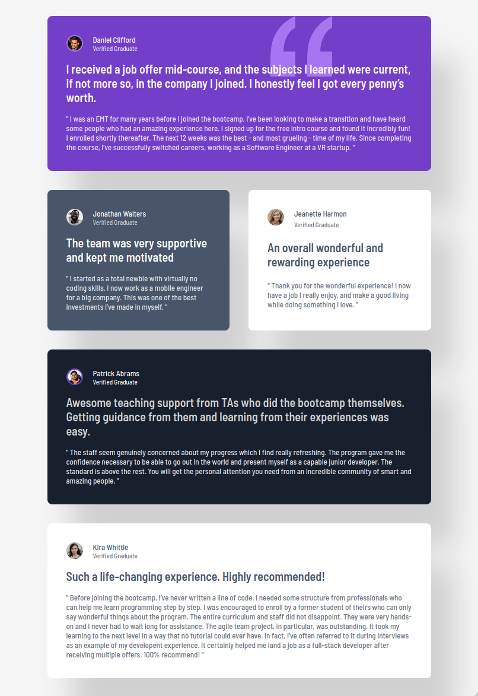
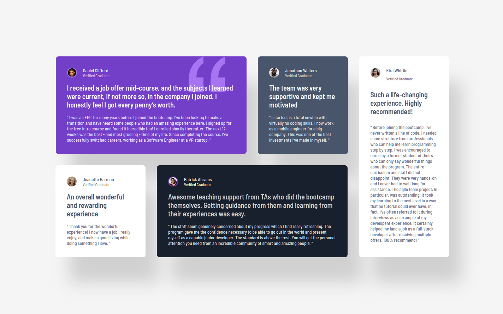

# Frontend Mentor - Testimonials grid section solution

This is a solution to the [Testimonials grid section challenge on Frontend Mentor](https://www.frontendmentor.io/challenges/testimonials-grid-section-Nnw6J7Un7). Frontend Mentor challenges help you improve your coding skills by building realistic projects.

## Table of contents

- [Overview](#overview)
  - [The challenge](#the-challenge)
  - [Screenshot](#screenshot)
  - [Links](#links)
- [My process](#my-process)
  - [Built with](#built-with)
  - [What I learned](#what-i-learned)
  - [AI Collaboration](#ai-collaboration)
- [Author](#author)

## Overview

### The challenge

Users should be able to:

- View the optimal layout for the site depending on their device's screen size
- View the responsive effect on the cards when displayed on very small screens.

### Screenshot

Mobile

Tablet

Desktop

### Links

- Solution URL: [Add solution URL here](https://your-solution-url.com)
- Live Site URL: [Add live site URL here](https://your-live-site-url.com)

## My process

### Built with

- Semantic HTML5 markup
- CSS custom properties
- Flexbox
- CSS Grid
- Mobile-first workflow

### What I learned

The principles were similar to the previous challenge.

### AI Collaboration

Had the help of Claude to understand why the box-shadows were overlapping the cards siblings.

## Author

- Github - [Devamaruk](https://github.com/DevAmaruk)
- Frontend Mentor - [@DevAmaruk](https://www.frontendmentor.io/profile/DevAmaruk)
- Linkedin - [Jonathan Guthauser](https://www.linkedin.com/in/jguthauser/)
